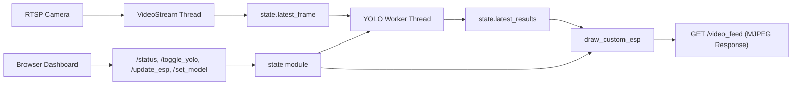
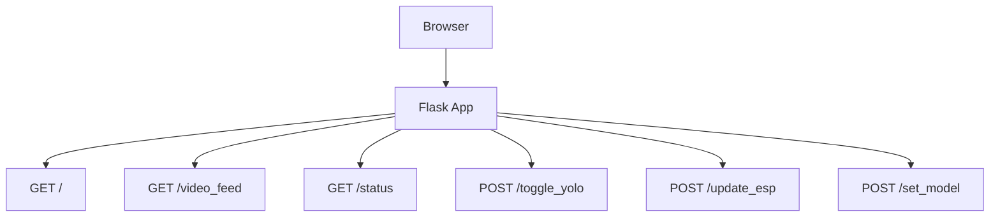
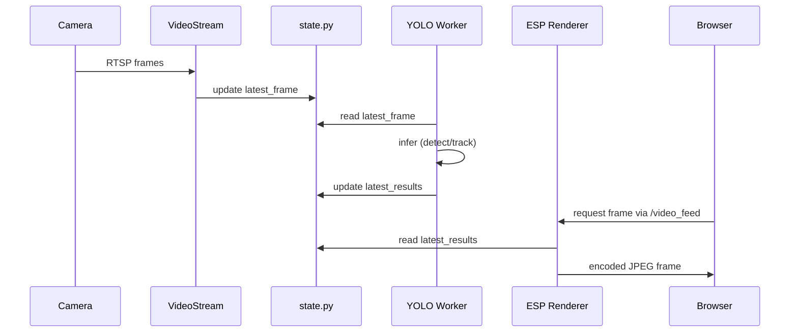
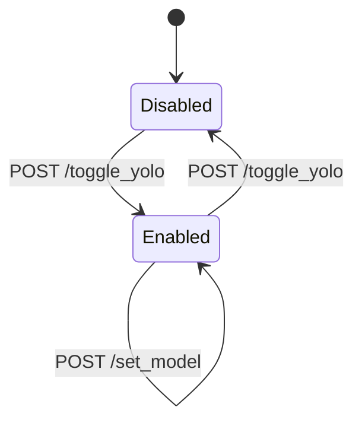

# SecurityCam


SecurityCam is a modular RTSP camera dashboard built with Flask, OpenCV, and YOLOv8. It provides live browser streaming, runtime AI toggling, model switching, GPU/CPU telemetry, and a full advanced ESP-style overlay control panel.

## Table of Contents

1. [Overview](#overview)
2. [Core Features](#core-features)
3. [Architecture](#architecture)
4. [Repository Layout](#repository-layout)
5. [How Runtime Processing Works](#how-runtime-processing-works)
6. [Requirements](#requirements)
7. [Quick Start](#quick-start)
8. [Configuration](#configuration)
9. [API Reference](#api-reference)
10. [ESP Features and Controls](#esp-features-and-controls)
11. [Model Management](#model-management)
12. [Performance Tuning](#performance-tuning)
13. [Operational Notes](#operational-notes)
14. [Troubleshooting](#troubleshooting)
15. [Development Workflow](#development-workflow)
16. [Security Notes](#security-notes)
17. [Roadmap](#roadmap)

## Overview

SecurityCam focuses on practical, real-time camera monitoring with optional AI inference:
- RTSP stream served directly to browser as MJPEG
- YOLOv8 detection and pose support
- full overlay customization (visual, prediction, face, hand, style)
- runtime model switching and runtime settings updates via HTTP API

The app is designed for local/self-hosted setups and can run in pure stream mode or AI-enhanced mode.

## Core Features

- Live stream endpoint: `GET /video_feed`
- Optional YOLO inference with runtime toggle: `POST /toggle_yolo`
- Runtime model switch: `POST /set_model`
- Live status and telemetry endpoint: `GET /status`
- Rich ESP overlay system with many feature groups:
  - box styles and line tuning
  - skeleton/head/snaplines/crosshair
  - tracking/tracers/velocity/prediction
  - face boxes/face zoom/face blur
  - hand skeleton overlay
  - thermal mode, class colors, center highlight
  - RGB mode and per-feature color controls

## Architecture

### High-Level Data Flow



### Request/Response Layer



## Repository Layout

```text
securitycam/
├─ .env.example
├─ .gitignore
├─ README.md
├─ main.py
├─ start_with_venv.bat
├─ start_without_venv.bat
├─ start_with_venv.sh
├─ start_without_venv.sh
├─ models/
└─ securitycam/
   ├─ __init__.py
   ├─ config.py
   ├─ deps.py
   ├─ esp.py
   ├─ state.py
   ├─ streaming.py
   ├─ templates.py
   ├─ validation.py
   └─ webapp.py
```

### Module Responsibilities

- `main.py`: entrypoint, starts Flask app
- `securitycam/config.py`: env parsing, defaults, model list, RTSP URL build
- `securitycam/state.py`: shared mutable runtime state
- `securitycam/deps.py`: dependency checks, optional auto-install, YOLO model load, GPU snapshot
- `securitycam/esp.py`: complete ESP drawing logic and color utilities
- `securitycam/streaming.py`: RTSP reader, YOLO worker, render pipeline, MJPEG generator
- `securitycam/templates.py`: embedded dashboard HTML/CSS/JS template
- `securitycam/webapp.py`: route wiring and JSON endpoints

## How Runtime Processing Works

### Sequence



### YOLO Runtime States



## Requirements

### Runtime

- Python 3.10+
- RTSP-compatible camera
- Windows or Linux

### Python packages

Install at least:
- `flask`
- `opencv-python`
- `ultralytics`

Optional:
- `torch`, `torchvision`, `torchaudio` (especially for CUDA)
- `mediapipe` (for hand skeleton feature)

## Quick Start

### 1) Clone and enter project

```bash
git clone <your-repo-url>
cd securitycam
```

### 2) Create virtual environment

```bash
python -m venv .venv
```

Windows PowerShell:

```powershell
.\.venv\Scripts\Activate.ps1
```

Linux/macOS:

```bash
source .venv/bin/activate
```

### 3) Install dependencies

```bash
pip install flask opencv-python ultralytics mediapipe
```

### 4) Configure environment

```bash
cp .env.example .env
```

Edit `.env` with your camera credentials and preferences.

### 5) Run app

```bash
python main.py
```

### 6) Open dashboard

`http://localhost:5000`

## One-command start scripts

Use the scripts below if you want install + run in one step.

### Windows

With venv:

```bat
start_with_venv.bat
```

Without venv:

```bat
start_without_venv.bat
```

### Linux/macOS

With venv:

```bash
chmod +x start_with_venv.sh
./start_with_venv.sh
```

Without venv:

```bash
chmod +x start_without_venv.sh
./start_without_venv.sh
```

What each script does:
- verifies Python availability
- installs/upgrades required packages (`flask`, `opencv-python`, `ultralytics`, `mediapipe`)
- starts `main.py`
- venv variant creates/uses `.venv`
- non-venv variant installs into the active/global interpreter environment

## Configuration

Configuration is loaded from environment variables, optionally from `.env` via `config.py`.

### Essential camera settings

| Variable | Required | Default | Description |
|---|---|---:|---|
| `SECURITYCAM_CAMERA_IP` | yes | empty | Camera IP / host |
| `SECURITYCAM_CAMERA_USERNAME` | yes | empty | RTSP username |
| `SECURITYCAM_CAMERA_PASSWORD` | yes | empty | RTSP password |
| `SECURITYCAM_CAMERA_STREAM_PATH` | no | `stream1` | Stream path (`stream1`, `stream2`, etc.) |

### App runtime settings

| Variable | Required | Default | Description |
|---|---|---:|---|
| `SECURITYCAM_APP_HOST` | no | `0.0.0.0` | Bind interface |
| `SECURITYCAM_APP_PORT` | no | `5000` | HTTP port |
| `SECURITYCAM_APP_DEBUG` | no | `false` | Flask debug mode |

### Security/session-related settings

| Variable | Required | Default | Description |
|---|---|---:|---|
| `SECURITYCAM_SECRET_KEY` | recommended | `change-me` or env value | Signing key |
| `SECURITYCAM_SESSION_COOKIE_SECURE` | no | `false` | Enable only with HTTPS |
| `SECURITYCAM_SESSION_COOKIE_SAMESITE` | no | `Lax` | SameSite policy |
| `SECURITYCAM_TRUSTED_HOSTS` | no | empty | Optional comma-separated host allow list |

### Model and performance settings

| Variable | Required | Default | Description |
|---|---|---:|---|
| `SECURITYCAM_YOLO_MODEL` | no | `yolov8n.pt` | Startup model |
| `SECURITYCAM_YOLO_IMG_SIZE` | no | `640` | Inference image size |
| `SECURITYCAM_DISPLAY_SCALE` | no | `1.0` | Display downscale factor |
| `SECURITYCAM_JPEG_QUALITY` | no | `85` | MJPEG quality |
| `SECURITYCAM_FACE_DETECT_EVERY` | no | `5` | Face detection cadence |
| `SECURITYCAM_FACE_DETECT_SCALE` | no | `0.5` | Face detection scaling |
| `SECURITYCAM_HAND_DETECT_EVERY` | no | `5` | Hand detection cadence |
| `SECURITYCAM_HAND_DETECT_SCALE` | no | `0.5` | Hand detection scaling |
| `SECURITYCAM_SMOOTH_ALPHA` | no | `0.6` | Box smoothing alpha |

### Dependency auto-install settings

| Variable | Required | Default | Description |
|---|---|---:|---|
| `SECURITYCAM_AUTO_INSTALL_DEPS` | no | `false` | Try auto-install if imports fail |
| `SECURITYCAM_TORCH_CUDA_INDEX_URL` | no | PyTorch nightly index | Index URL used for auto-install |

## API Reference

### `GET /`
Returns dashboard HTML.

### `GET /video_feed`
Returns MJPEG stream.

### `GET /status`
Returns live runtime telemetry and settings.

Typical fields:
- `fps`
- `inference_fps`
- `last_infer_ms`
- `num_detections`
- `faces`
- `classes`
- `resolution`
- `yolo_enabled`
- `yolo_available`
- `yolo_model`
- `available_models`
- `device`
- `cuda_available`
- `esp_settings`
- `gpu`

### `POST /toggle_yolo`
Toggles YOLO state.

Response example:

```json
{ "yolo_enabled": true }
```

### `POST /set_model`
Request:

```json
{ "model_name": "yolov8s.pt" }
```

Possible responses:
- `200`: model switched or already selected
- `400`: invalid model

### `POST /update_esp`
Accepts partial ESP setting payload and updates runtime settings.

## ESP Features and Controls

The dashboard includes the complete advanced ESP feature set.

### Visual features

- Box rendering (`full`, `corner`, `3d`)
- Skeleton overlay
- Head marker
- Snaplines
- Crosshair (`center_dot`)
- Class names
- Confidence
- Distance estimate
- Face boxes
- Face zoom inset
- Hand skeleton
- Chams
- Face blur
- Box fill
- Class colors
- Person-only filtering
- Highlight center target
- Thermal mode

### Prediction/tracking features

- Tracking IDs
- Tracers
- Velocity vectors
- Prediction markers

### Style features

- RGB rainbow mode (`gay_mode`)
- Primary/secondary color control
- Per-feature color overrides:
  - boxes
  - skeleton
  - head
  - tracers
  - velocity
  - prediction
  - face
  - hand
  - text
  - chams

### Key tunables

- confidence threshold
- line thickness
- face zoom scale
- chams opacity
- face blur strength

## Model Management

Available startup/runtime model names include:
- `yolov8n.pt`, `yolov8n-pose.pt`
- `yolov8s.pt`, `yolov8s-pose.pt`
- `yolov8m.pt`, `yolov8m-pose.pt`
- `yolov8l.pt`, `yolov8l-pose.pt`
- `yolov8x.pt`, `yolov8x-pose.pt`

Model loading behavior:
- if local model file exists in `models/`, it is used
- otherwise, Ultralytics may resolve/download model by name

## Performance Tuning

Main levers:
- reduce `SECURITYCAM_YOLO_IMG_SIZE` for faster inference
- reduce `SECURITYCAM_DISPLAY_SCALE` for lower CPU/network usage
- reduce `SECURITYCAM_JPEG_QUALITY` for lower bandwidth
- increase `SECURITYCAM_FACE_DETECT_EVERY` and `SECURITYCAM_HAND_DETECT_EVERY` to reduce overhead
- adjust `SECURITYCAM_SMOOTH_ALPHA` for stability vs latency

Suggested profiles:

| Profile | YOLO_IMG_SIZE | DISPLAY_SCALE | JPEG_QUALITY | FACE_EVERY | HAND_EVERY |
|---|---:|---:|---:|---:|---:|
| Quality | 960 | 1.0 | 90 | 3 | 3 |
| Balanced | 640 | 1.0 | 85 | 5 | 5 |
| Performance | 512 | 0.8 | 75 | 8 | 8 |
| CPU-focused | 416 | 0.7 | 70 | 10 | 10 |

## Operational Notes

- YOLO can be fully disabled while streaming continues
- worker thread decouples inference from stream encoding
- if CUDA runtime errors occur, code falls back to CPU in worker logic
- metrics are refreshed and exposed through `/status`

## Troubleshooting

### No stream image

Check:
- camera IP, username, password, stream path
- RTSP URL manually in VLC
- firewall and network routing
- camera RTSP capability and concurrent session limits

### YOLO not available

Check:
- `torch` and `ultralytics` installation
- active Python environment
- startup logs from dependency initialization

### Overlay not updating

Check:
- browser console for failed API requests
- `/update_esp` response payload
- that the setting key exists in `state.esp_settings`

### High latency or low FPS

Try:
- lower `SECURITYCAM_YOLO_IMG_SIZE`
- lower `SECURITYCAM_DISPLAY_SCALE`
- disable costly overlays (face zoom, hand skeleton, tracers)
- increase detection cadence values

## Development Workflow

### Run locally

```bash
python -m venv .venv
# activate virtual environment
pip install flask opencv-python ultralytics mediapipe
python main.py
```

### Syntax check

```bash
python -m compileall main.py securitycam
```

### Typical implementation flow

1. add/adjust runtime setting in `config.py`
2. expose it through dashboard controls in `templates.py`
3. consume it in `esp.py` or `streaming.py`
4. verify via `/status`

## Security Notes

This project now uses environment-based credentials and avoids hardcoded camera secrets in source code.

Recommended deployment hardening:
- keep `SECURITYCAM_APP_DEBUG=false`
- set a strong `SECURITYCAM_SECRET_KEY`
- use HTTPS via reverse proxy
- restrict network access to trusted clients
- avoid exposing dashboard publicly without authentication at network edge

## Roadmap

- optional dashboard authentication
- optional event snapshots/recording triggers
- richer multi-camera support
- deeper API contract validation for `/update_esp`
- automated tests for endpoints and runtime config
