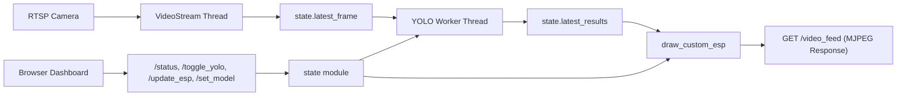
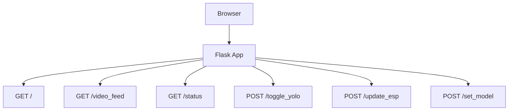
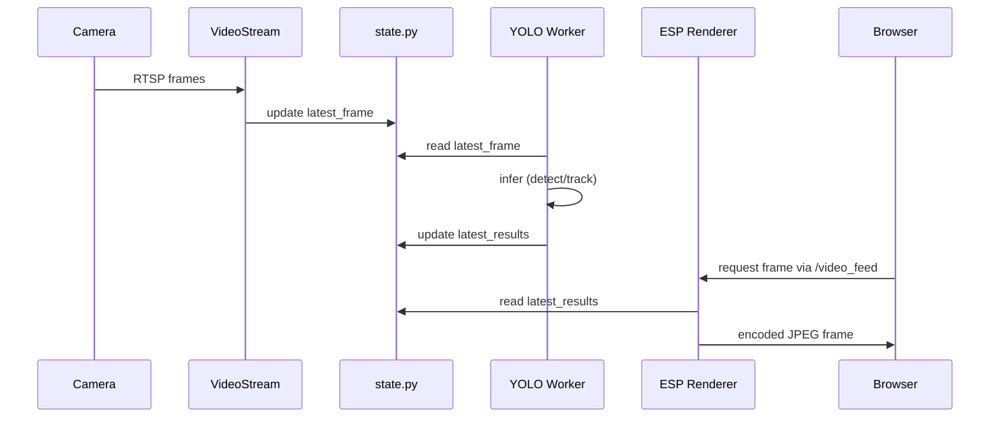
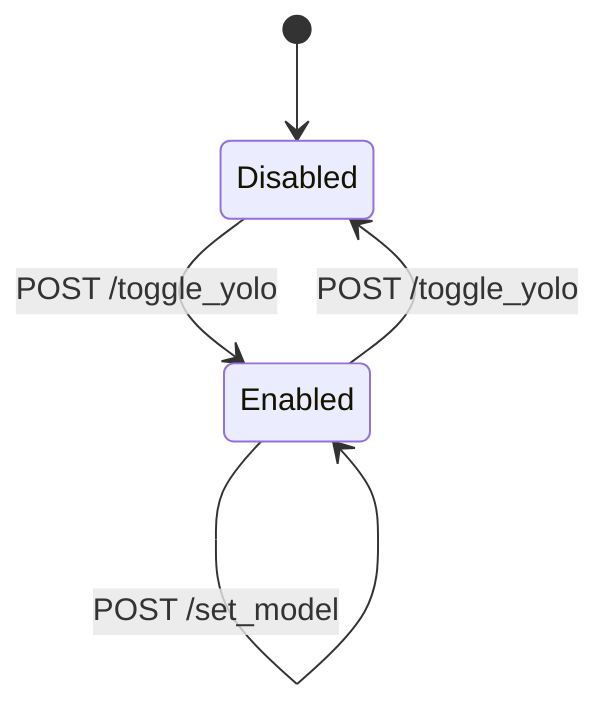

# SecurityCam


SecurityCam is a modular RTSP camera dashboard built with Flask, OpenCV, and YOLOv8. It provides live browser streaming, runtime AI toggling, model switching, GPU/CPU telemetry, and a full advanced ESP-style overlay control panel.

## Table of Contents

1. [Overview](#overview)
2. [Core Features](#core-features)
3. [Architecture](#architecture)
4. [Repository Layout](#repository-layout)
5. [How Runtime Processing Works](#how-runtime-processing-works)
6. [Requirements](#requirements)
7. [Quick Start](#quick-start)
8. [Configuration](#configuration)
9. [API Reference](#api-reference)
10. [ESP Features and Controls](#esp-features-and-controls)
11. [Model Management](#model-management)
12. [Performance Tuning](#performance-tuning)
13. [Operational Notes](#operational-notes)
14. [Troubleshooting](#troubleshooting)
15. [Development Workflow](#development-workflow)
16. [Security Notes](#security-notes)
17. [Roadmap](#roadmap)

## Overview

SecurityCam focuses on practical, real-time camera monitoring with optional AI inference:
- RTSP stream served directly to browser as MJPEG
- multi-camera workspace with closable camera tabs
- YOLOv8 detection and pose support
- full overlay customization (visual, prediction, face, hand, style)
- runtime model switching and runtime settings updates via HTTP API

The app is designed for local/self-hosted setups and can run in pure stream mode or AI-enhanced mode.

## Core Features

- Live stream endpoint: `GET /video_feed`
- Camera-specific stream endpoint: `GET /video_feed/<camera_id>`
- Optional YOLO inference with runtime toggle: `POST /toggle_yolo`
- Runtime model switch: `POST /set_model`
- Live status and telemetry endpoint: `GET /status`
- Camera-specific API endpoints under `/api/cameras/<camera_id>/...`
- Rich ESP overlay system with many feature groups:
  - box styles and line tuning
  - skeleton/head/snaplines/crosshair
  - tracking/tracers/velocity/prediction
  - face boxes/face zoom/face blur
  - hand skeleton overlay
  - thermal mode, class colors, center highlight
  - RGB mode and per-feature color controls

## Architecture

### High-Level Data Flow


```mermaid
flowchart LR
    CAM["RTSP Camera"] --> VS["VideoStream Thread"]
    VS --> LF["state.latest_frame"]
    LF --> YW["YOLO Worker Thread"]
    YW --> LR["state.latest_results"]
    LR --> RENDER["draw_custom_esp"]
    RENDER --> MJPEG["GET /video_feed (MJPEG Response)"]

    UI["Browser Dashboard"] --> API["/status, /toggle_yolo, /update_esp, /set_model"]
    API --> STATE["state module"]
    STATE --> YW
    STATE --> RENDER
```

### Request/Response Layer


```mermaid
flowchart TB
    BR["Browser"] --> FL["Flask App"]
    FL --> IDX["GET /"]
    FL --> VFEED["GET /video_feed"]
    FL --> ST["GET /status"]
    FL --> TGL["POST /toggle_yolo"]
    FL --> ESP["POST /update_esp"]
    FL --> MOD["POST /set_model"]
```

## Repository Layout

```text
securitycam/
├─ .env.example
├─ .gitignore
├─ README.md
├─ main.py
├─ start_with_venv.bat
├─ start_without_venv.bat
├─ start_with_venv.sh
├─ start_without_venv.sh
├─ models/
├─ frontend/              # React + TypeScript + shadcn/ui dashboard (Vite)
└─ securitycam/
   ├─ __init__.py
   ├─ config.py
   ├─ deps.py
   ├─ esp/                # ESP overlay package (settings, colors, detections, renderers, pipeline)
   ├─ state.py
   ├─ static/app/         # built frontend (output of `npm run build`)
   ├─ streaming.py
   ├─ validation.py
   └─ webapp.py
```

### Module Responsibilities

- `main.py`: entrypoint, starts Flask app
- `securitycam/config.py`: env parsing, defaults, model list, RTSP URL build
- `securitycam/state.py`: shared mutable runtime state
- `securitycam/deps.py`: dependency checks, optional auto-install, YOLO model load, GPU snapshot
- `securitycam/esp/`: ESP overlay — `settings.py` (per-frame settings snapshot), `colors.py`, `detections.py` (extraction, smoothing, track history), `sensors.py` (face/hand detection), `renderers.py` (one function per feature), `pipeline.py` (`draw_custom_esp`)
- `securitycam/streaming.py`: RTSP reader, YOLO worker, render pipeline, MJPEG generator
- `securitycam/validation.py`: validates every ESP setting sent to `update_esp`
- `securitycam/webapp.py`: serves the built frontend, route wiring and JSON endpoints
- `frontend/`: React + TypeScript + shadcn/ui source of the dashboard

## How Runtime Processing Works

### Sequence


```mermaid
sequenceDiagram
    participant C as Camera
    participant VS as VideoStream
    participant S as state.py
    participant W as YOLO Worker
    participant E as ESP Renderer
    participant B as Browser

    C->>VS: RTSP frames
    VS->>S: update latest_frame
    W->>S: read latest_frame
    W->>W: infer (detect/track)
    W->>S: update latest_results
    B->>E: request frame via /video_feed
    E->>S: read latest_results
    E->>B: encoded JPEG frame
```

### YOLO Runtime States


```mermaid
stateDiagram-v2
    [*] --> Disabled
    Disabled --> Enabled: POST /toggle_yolo
    Enabled --> Disabled: POST /toggle_yolo
    Enabled --> Enabled: POST /set_model
```

## Requirements

### Runtime

- Python 3.10+
- RTSP-compatible camera
- Windows or Linux

### Python packages

Install at least:
- `flask`
- `opencv-python`
- `ultralytics`

Optional:
- `torch`, `torchvision`, `torchaudio` (especially for CUDA)
- `mediapipe` (for hand skeleton feature)

## Quick Start

### 1) Clone and enter project

```bash
git clone https://github.com/N0tMaggi/rtsp-vision-dashboard.git
cd securitycam
```

### 2) Create virtual environment

```bash
python -m venv .venv
```

Windows PowerShell:

```powershell
.\.venv\Scripts\Activate.ps1
```

Linux/macOS:

```bash
source .venv/bin/activate
```

### 3) Install dependencies

```bash
pip install flask opencv-python ultralytics mediapipe
```

### 4) Configure environment

```bash
cp .env.example .env
```

Edit `.env` with your camera credentials and preferences.

### 5) Run app

```bash
python main.py
```

### 6) Open dashboard

`http://localhost:5000`

## One-command start scripts

Use the scripts below if you want install + run in one step.

### Windows

With venv:

```bat
start_with_venv.bat
```

Without venv:

```bat
start_without_venv.bat
```

### Linux/macOS

With venv:

```bash
chmod +x start_with_venv.sh
./start_with_venv.sh
```

Without venv:

```bash
chmod +x start_without_venv.sh
./start_without_venv.sh
```

What each script does:
- verifies Python availability
- installs/upgrades required packages (`flask`, `opencv-python`, `ultralytics`, `mediapipe`)
- starts `main.py`
- venv variant creates/uses `.venv`
- non-venv variant installs into the active/global interpreter environment

## Configuration

Configuration is loaded from environment variables, optionally from `.env` via `config.py`.

### Essential camera settings

| Variable | Required | Default | Description |
|---|---|---:|---|
| `SECURITYCAM_CAMERAS` | no | empty | Semicolon-separated camera list: `id|Label|ip|username|password|stream_path` |
| `SECURITYCAM_CAMERA_IP` | yes | empty | Camera IP / host |
| `SECURITYCAM_CAMERA_USERNAME` | yes | empty | RTSP username |
| `SECURITYCAM_CAMERA_PASSWORD` | yes | empty | RTSP password |
| `SECURITYCAM_CAMERA_STREAM_PATH` | no | `stream1` | Stream path (`stream1`, `stream2`, etc.) |

If `SECURITYCAM_CAMERAS` is set, the legacy single-camera variables are used only as fallback defaults.

### App runtime settings

| Variable | Required | Default | Description |
|---|---|---:|---|
| `SECURITYCAM_APP_HOST` | no | `0.0.0.0` | Bind interface |
| `SECURITYCAM_APP_PORT` | no | `5000` | HTTP port |
| `SECURITYCAM_APP_DEBUG` | no | `false` | Flask debug mode |

### Security/session-related settings

| Variable | Required | Default | Description |
|---|---|---:|---|
| `SECURITYCAM_SECRET_KEY` | recommended | `change-me` or env value | Signing key |
| `SECURITYCAM_SESSION_COOKIE_SECURE` | no | `false` | Enable only with HTTPS |
| `SECURITYCAM_SESSION_COOKIE_SAMESITE` | no | `Lax` | SameSite policy |
| `SECURITYCAM_TRUSTED_HOSTS` | no | empty | Optional comma-separated host allow list |

### Model and performance settings

| Variable | Required | Default | Description |
|---|---|---:|---|
| `SECURITYCAM_YOLO_MODEL` | no | `yolov8n.pt` | Startup model |
| `SECURITYCAM_YOLO_IMG_SIZE` | no | `640` | Inference image size |
| `SECURITYCAM_DISPLAY_SCALE` | no | `1.0` | Display downscale factor |
| `SECURITYCAM_JPEG_QUALITY` | no | `85` | Default MJPEG quality (per camera adjustable in the ESP menu) |
| `SECURITYCAM_FACE_DETECT_EVERY` | no | `5` | Face detection cadence |
| `SECURITYCAM_FACE_DETECT_SCALE` | no | `0.5` | Face detection scaling |
| `SECURITYCAM_HAND_DETECT_EVERY` | no | `5` | Hand detection cadence |
| `SECURITYCAM_HAND_DETECT_SCALE` | no | `0.5` | Hand detection scaling |
| `SECURITYCAM_SMOOTH_ALPHA` | no | `0.6` | Default box smoothing, 0 = raw boxes at inference rate (per camera adjustable in the ESP menu) |
| `SECURITYCAM_ESP_FONT` | no | – | Path to a TrueType font for ESP labels (falls back to Consolas / DejaVu Sans Mono) |
| `SECURITYCAM_TORCH_CUDA` | no | `cu134` | CUDA flavour the Windows start scripts install when an NVIDIA GPU is present but torch is CPU-only |

### Dependency auto-install settings

| Variable | Required | Default | Description |
|---|---|---:|---|
| `SECURITYCAM_AUTO_INSTALL_DEPS` | no | `false` | Try auto-install if imports fail |
| `SECURITYCAM_TORCH_CUDA_INDEX_URL` | no | PyTorch nightly index | Index URL used for auto-install |

## API Reference

### `GET /`
Returns dashboard HTML.

### `GET /video_feed`
Returns MJPEG stream.

### `GET /video_feed/<camera_id>`
Returns MJPEG stream for the selected camera.

### `GET /status`
Returns live runtime telemetry and settings.

### `GET /api/cameras/<camera_id>/status`
Returns runtime telemetry and settings for the selected camera.

Typical fields:
- `fps`
- `inference_fps`
- `last_infer_ms`
- `num_detections`
- `faces`
- `classes`
- `resolution`
- `yolo_enabled`
- `yolo_available`
- `yolo_model`
- `available_models`
- `device`
- `cuda_available`
- `esp_settings`
- `gpu`

### `POST /toggle_yolo`
Toggles YOLO state.

Response example:

```json
{ "yolo_enabled": true }
```

### `POST /api/cameras/<camera_id>/toggle_yolo`
Toggles YOLO state for the selected camera.

### `POST /set_model`
Request:

```json
{ "model_name": "yolov8s.pt" }
```

Possible responses:
- `200`: model switched or already selected
- `400`: invalid model

### `POST /api/cameras/<camera_id>/set_model`
Switches the model for the selected camera.

### `POST /update_esp`
Accepts partial ESP setting payload and updates runtime settings.

### `POST /api/cameras/<camera_id>/update_esp`
Accepts partial ESP setting payload and updates runtime settings for the selected camera.

## ESP Features and Controls

The dashboard includes the complete advanced ESP feature set.

### Visual features

- Box rendering (`full`, `corner`, `3d`)
- Skeleton overlay
- Head marker
- Snaplines
- Crosshair (`center_dot`)
- Class names
- Confidence
- Distance estimate
- Face boxes
- Face zoom inset
- Hand skeleton
- Chams
- Face blur
- Box fill
- Class colors
- Person-only filtering
- Highlight center target
- Thermal mode

### Prediction/tracking features

- Tracking IDs
- Tracers
- Velocity vectors
- Prediction markers

### Style features

- RGB rainbow mode (`rgb_mode`; the legacy key `gay_mode` is still accepted by the update endpoint)
- Primary/secondary color control
- Per-feature color overrides:
  - boxes
  - skeleton
  - head
  - tracers
  - velocity
  - prediction
  - face
  - hand
  - text
  - chams

### Key tunables

- confidence threshold
- line thickness
- face zoom scale
- chams opacity
- face blur strength

## Alarms and Events

Everything lives in `securitycam/alerts/` (Flask blueprint) and `securitycam/esp/alerts_render.py`.
Alarms are evaluated in the render path, so they run while the camera is being viewed and detection is on.

- **Zone rules**: arm any zone in the ESP menu under *Alarms*. Optional class filter (e.g. only `person`),
  minimum dwell time (seconds a target's center must stay inside) and a schedule (always, or a time window
  such as 22:00-06:00). A triggered zone pulses red with `ALARM` in its pill.
- **Tripwires**: press `T` (or *Draw Tripwire*) and drag a line. The ESP draws the line, an arrow for the
  "in" direction (a→b rotated 90° clockwise) and `↑ in  ↓ out` counters. Crossings are detected from the
  motion model's per-track center history (stable track ids; turn on Tracking for best results). A tripwire can
  raise an alarm for both directions or one, optionally only for some classes. *Flip* swaps the direction.
- **Abandoned objects**: with *Abandoned Objects* on, bags/suitcases/umbrellas/laptops
  (`SECURITYCAM_ABANDON_CLASSES`) that appear and stay put for *Abandoned After* seconds are marked
  `NEW SINCE 14:32` and create an event. Objects already visible in the first seconds after detection starts
  are treated as background.
- **Events**: each alarm stores `data/events/<camera>/<YYYYMMDD-HHMMSS-mmm>/` with `meta.json`,
  `snapshot.jpg`, `thumb.jpg` and a clip from ~10 s before to ~10 s after the trigger. Clips come from a
  bounded per-camera ring buffer of the rendered (overlay) JPEG frames. The encoder is probed once:
  WebM/VP8, then MP4/H.264 (both play in Chrome); if neither works, the clip is a JPEG sequence
  (`frames/00000.jpg ...`) that the UI plays as an animation. Old events are removed by count/age.
- **Notifications**: ntfy, Telegram and Discord (all optional, with snapshot). Sent from a background
  queue with a cooldown per rule; errors are logged without URLs or tokens.
- **Snapshots**: `S` saves the current rendered frame to `data/snapshots/` and downloads it in the browser.
- **UI**: the siren button in the header opens the event timeline (`E`), shows an unread badge and pulses
  red while an alarm is active; new alarms pop up as toasts at the top.

Rules and tripwires persist in `data/alerts.json` (atomic writes). `data/` is git-ignored.

### Alarm settings (.env)

| Variable | Default | Description |
|---|---:|---|
| `SECURITYCAM_DATA_DIR` | `./data` | Root for `alerts.json`, `events/`, `snapshots/` |
| `SECURITYCAM_CLIP_PRE_S` / `SECURITYCAM_CLIP_POST_S` | `10` / `10` | Clip seconds before / after the trigger |
| `SECURITYCAM_CLIP_FPS` | `10` | Frame rate of the pre-roll buffer and clips |
| `SECURITYCAM_CLIP_BUFFER_MB` | `96` | Max memory of the per-camera frame buffer |
| `SECURITYCAM_CLIP_MAX_WIDTH` | `1280` | Clips are downscaled to this width |
| `SECURITYCAM_CLIP_FORMAT` | `auto` | `auto`, `webm`, `mp4` or `jpeg` |
| `SECURITYCAM_EVENTS_MAX_COUNT` | `300` | Keep at most this many events (all cameras) |
| `SECURITYCAM_EVENTS_MAX_AGE_DAYS` | `14` | Delete older events (`0` = keep) |
| `SECURITYCAM_ALARM_COOLDOWN_S` | `30` | Min. seconds between events of the same rule/tripwire |
| `SECURITYCAM_ALARM_HOLD_S` | `4` | How long the red alarm style stays after the condition ends |
| `SECURITYCAM_NOTIFY_COOLDOWN_S` | `60` | Min. seconds between notifications of the same rule/tripwire |
| `SECURITYCAM_NTFY_URL` / `SECURITYCAM_NTFY_TOKEN` | empty | ntfy topic URL (e.g. `https://ntfy.sh/my-secret-topic`), optional access token |
| `SECURITYCAM_TELEGRAM_BOT_TOKEN` / `SECURITYCAM_TELEGRAM_CHAT_ID` | empty | Telegram bot (photo + caption) |
| `SECURITYCAM_DISCORD_WEBHOOK_URL` | empty | Discord webhook (message + image) |
| `SECURITYCAM_ABANDON_CLASSES` | `backpack,handbag,suitcase,umbrella,laptop` | COCO classes watched as abandoned objects |

New ESP setting keys: `alarms` (evaluate rules), `tripwires` (draw tripwires), `abandoned`, `abandoned_seconds` (5-600).

### Alarm API

| Method | Path | Purpose |
|---|---|---|
| `GET` / `PATCH` | `/api/cameras/<id>/alerts` | Rules, tripwires (with live counters), channel status / set `abandoned_notify` |
| `PUT` / `DELETE` | `/api/cameras/<id>/zones/<zone_id>/rule` | Create/update or remove a zone rule (`enabled`, `classes`, `min_dwell_s`, `schedule`, `notify`) |
| `GET` / `POST` | `/api/cameras/<id>/tripwires` | List / create (`{"a": [x, y], "b": [x, y]}`, normalized) |
| `PATCH` / `DELETE` | `/api/cameras/<id>/tripwires/<tid>` | Update (`label`, `trigger`, `alarm`, `classes`, `color`, `notify`, `flip`) / delete |
| `POST` | `/api/cameras/<id>/tripwires/<tid>/reset` | Reset counters |
| `GET` | `/api/events?camera=&since=&limit=` | Events (newest first) and currently active alarms |
| `GET` / `DELETE` | `/api/events/<camera>/<event_id>` | Event metadata / delete event |
| `GET` | `/api/events/<camera>/<event_id>/{thumb.jpg,snapshot.jpg,clip}` | Files (clip supports HTTP ranges) |
| `GET` | `/api/events/<camera>/<event_id>/frames/<n>.jpg` | JPEG-sequence clip frames |
| `POST` | `/api/cameras/<id>/snapshot` | Save + return the current rendered frame |
| `POST` | `/api/notify/test` | Send a test notification (`{"camera": "<id>"}`) |

## Model Management

Available startup/runtime model names include:
- `yolov8n.pt`, `yolov8n-pose.pt`
- `yolov8s.pt`, `yolov8s-pose.pt`
- `yolov8m.pt`, `yolov8m-pose.pt`
- `yolov8l.pt`, `yolov8l-pose.pt`
- `yolov8x.pt`, `yolov8x-pose.pt`

Model loading behavior:
- if local model file exists in `models/`, it is used
- otherwise, Ultralytics may resolve/download model by name

## Performance Tuning

Main levers:
- reduce `SECURITYCAM_YOLO_IMG_SIZE` for faster inference
- reduce `SECURITYCAM_DISPLAY_SCALE` for lower CPU/network usage
- reduce `SECURITYCAM_JPEG_QUALITY` for lower bandwidth
- increase `SECURITYCAM_FACE_DETECT_EVERY` and `SECURITYCAM_HAND_DETECT_EVERY` to reduce overhead
- adjust `SECURITYCAM_SMOOTH_ALPHA` for stability vs latency

Suggested profiles:

| Profile | YOLO_IMG_SIZE | DISPLAY_SCALE | JPEG_QUALITY | FACE_EVERY | HAND_EVERY |
|---|---:|---:|---:|---:|---:|
| Quality | 960 | 1.0 | 90 | 3 | 3 |
| Balanced | 640 | 1.0 | 85 | 5 | 5 |
| Performance | 512 | 0.8 | 75 | 8 | 8 |
| CPU-focused | 416 | 0.7 | 70 | 10 | 10 |

## Operational Notes

- YOLO can be fully disabled while streaming continues
- worker thread decouples inference from stream encoding
- if CUDA runtime errors occur, code falls back to CPU in worker logic
- metrics are refreshed and exposed through `/status`

## Troubleshooting

### No stream image

Check:
- camera IP, username, password, stream path
- RTSP URL manually in VLC
- firewall and network routing
- camera RTSP capability and concurrent session limits

### YOLO not available

Check:
- `torch` and `ultralytics` installation
- active Python environment
- startup logs from dependency initialization

### Overlay not updating

Check:
- browser console for failed API requests
- `/update_esp` response payload
- that the setting key exists in `state.esp_settings`

### High latency or low FPS

Try:
- lower `SECURITYCAM_YOLO_IMG_SIZE`
- lower `SECURITYCAM_DISPLAY_SCALE`
- disable costly overlays (face zoom, hand skeleton, tracers)
- increase detection cadence values

## Development Workflow

### Run locally

```bash
python -m venv .venv
# activate virtual environment
pip install flask opencv-python ultralytics mediapipe
python main.py
```

### Frontend (React + TypeScript + shadcn/ui)

The built dashboard lives in `securitycam/static/app/` and is committed, so the start scripts work without Node.js. To change the UI (Node 20+):

```bash
cd frontend
npm install
npm run dev     # http://localhost:5173, proxies /api and /video_feed to Flask on :5000
npm run build   # type-checks and writes securitycam/static/app/
```

### Syntax check

```bash
python -m compileall main.py securitycam
```

### Typical implementation flow

1. add/adjust the runtime setting in `config.py` (`DEFAULT_ESP_SETTINGS`) and its rule in `validation.py`
2. expose it in `frontend/src/lib/esp-schema.ts`
3. consume it in `securitycam/esp/` or `streaming.py`
4. rebuild the frontend and verify via `/status`

## Security Notes

This project now uses environment-based credentials and avoids hardcoded camera secrets in source code.

Recommended deployment hardening:
- keep `SECURITYCAM_APP_DEBUG=false`
- set a strong `SECURITYCAM_SECRET_KEY`
- use HTTPS via reverse proxy
- restrict network access to trusted clients
- avoid exposing dashboard publicly without authentication at network edge

## Roadmap

- optional dashboard authentication
- richer multi-camera support
- deeper API contract validation for `/update_esp`
- automated tests for endpoints and runtime config
